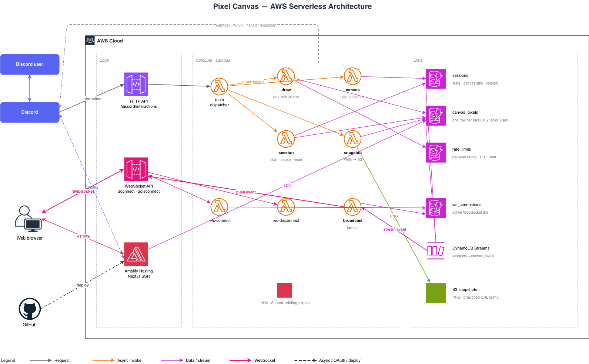

# Architecture

Pixel Canvas is a real-time collaborative pixel canvas built on a fully serverless AWS stack. Two entry points (Discord interactions and a Next.js web app) write to the same DynamoDB tables; DynamoDB Streams fan changes out to all connected browsers through an API Gateway WebSocket.

## Cloud Services

| Service              | Resource                | Role                                                     |
| -------------------- | ----------------------- | -------------------------------------------------------- |
| **Lambda**           | 8 functions (arm64)     | Dispatcher, domain commands, WebSocket lifecycle, broadcast |
| **API Gateway HTTP** | 1 API                   | Discord interaction webhook (Ed25519-verified)           |
| **API Gateway WS**   | 1 API                   | Bidirectional channel to browser clients                 |
| **DynamoDB**         | 4 tables + 2 streams    | Source of truth; streams drive the real-time fan-out     |
| **S3**               | 1 bucket                | Canvas snapshot PNGs (presigned URLs)                    |
| **Amplify Hosting**  | 1 app (WEB_COMPUTE)     | Next.js SSR frontend + API routes                        |
| **IAM**              | 8 roles                 | Least-privilege, one role per Lambda + Amplify compute   |

## Components & Responsibilities

- **Main Lambda** — HTTP API entry point. Verifies Discord signatures, routes slash commands via async Lambda invoke. No data access.
- **Draw / Canvas / Session / Snapshot Lambdas** — Domain handlers. Each owns a single command and only the IAM permissions it needs.
- **ws-connect / ws-disconnect Lambdas** — Maintain the `ws_connections` registry on `$connect` / `$disconnect`.
- **Broadcast Lambda** — Triggered by DynamoDB Streams on `sessions` and `canvas_pixels`. Builds typed events and pushes them to every active connection via the WebSocket Management API. Prunes stale connections on `410 Gone`.
- **Amplify (Next.js SSR)** — Serves the UI, handles Discord OAuth2, and exposes API routes that write directly to DynamoDB.

## Data Flow

**Pixel write (Discord)** — HTTP API → main → async invoke → draw Lambda → rate-limit check (`rate_limits`) → write to `canvas_pixels` → stream → broadcast → WebSocket clients.

**Pixel write (Web)** — Browser → Amplify SSR API route → direct `canvas_pixels` write → stream → broadcast → WebSocket clients.

**Session state change** — Any command mutating `sessions` triggers the stream on `NEW_AND_OLD_IMAGES`; broadcast emits `canvas.reset` or `session.state_changed` depending on the diff.

**Snapshot** — Snapshot Lambda (1024 MB / 120 s) queries all pixels, renders PNG, uploads to S3, writes presigned URL back on the session item.

Using DynamoDB Streams as the only integration point between write paths and the broadcast path keeps both entry points (Discord, Web) symmetric and decouples them — no direct Lambda-to-Lambda call is required for real-time updates.

## DynamoDB Schema

Single-table-style keys, one table per bounded concern.

| Table            | PK                       | SK                         | Stream               | Notes |
| ---------------- | ------------------------ | -------------------------- | -------------------- | ----- |
| `sessions`       | `SESSION#{sessionId}`    | `METADATA`                 | `NEW_AND_OLD_IMAGES` | `status`, `canvas_size`, `canvas_version`, `last_snapshot_url` |
| `canvas_pixels`  | `SESSION#{sessionId}`    | `PIXEL#{x}#{y}`            | `NEW_IMAGE`          | `color`, `user_id`, `updated_at` |
| `rate_limits`    | `USER#{userId}`          | `SESSION#{sessionId}`      | —                    | TTL-based, 20 px/min window |
| `ws_connections` | `ROOM#public`            | `CONNECTION#{connectionId}`| —                    | `domain_name`, `stage` for Management API |

## IAM Permissions Matrix

One role per Lambda. Each role carries the minimum table/resource access required.

| Lambda        | sessions | canvas_pixels | rate_limits | ws_connections | S3  | Lambda Invoke                   | WS Manage |
| ------------- | -------- | ------------- | ----------- | -------------- | --- | ------------------------------- | --------- |
| main          | —        | —             | —           | —              | —   | draw, canvas, session, snapshot | —         |
| draw          | R        | RW            | RW          | —              | —   | —                               | —         |
| canvas        | R        | —             | —           | —              | —   | —                               | —         |
| session       | RW       | RW            | —           | —              | —   | —                               | —         |
| snapshot      | R        | R             | —           | —              | RW  | —                               | —         |
| ws-connect    | —        | —             | —           | W              | —   | —                               | —         |
| ws-disconnect | —        | —             | —           | D              | —   | —                               | —         |
| broadcast     | —        | —             | —           | RD             | —   | —                               | Yes       |

**Legend** — R: Read · W: Write · D: Delete · RW: Read/Write · RD: Read/Delete

## Key Architectural Decisions

- **Streams over direct invocation.** Write paths never call broadcast directly; they mutate DynamoDB and the stream does the fan-out. Both entry points stay independent.
- **One Lambda per command, one IAM role per Lambda.** Blast radius of a compromise is limited to a single table subset.
- **Single WebSocket room (`ROOM#public`).** Simpler partition design; scaling out to per-session rooms is a PK change, not a rewrite.
- **Rate limiting in DynamoDB with TTL.** No external cache; expired windows are cleaned up by the service itself.
- **Amplify SSR writes directly to DynamoDB.** Avoids a redundant API layer for the web path while keeping the same downstream fan-out.
